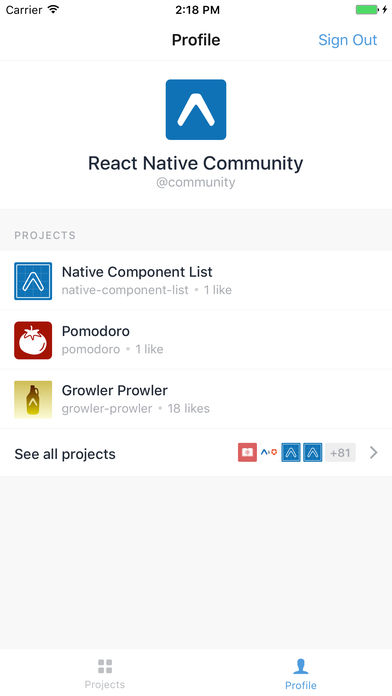
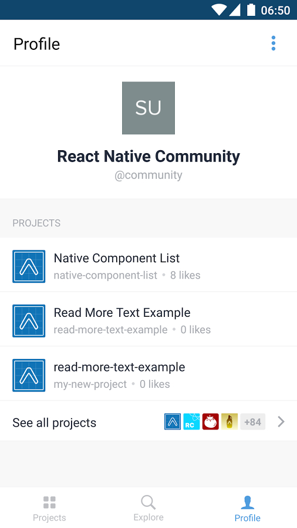
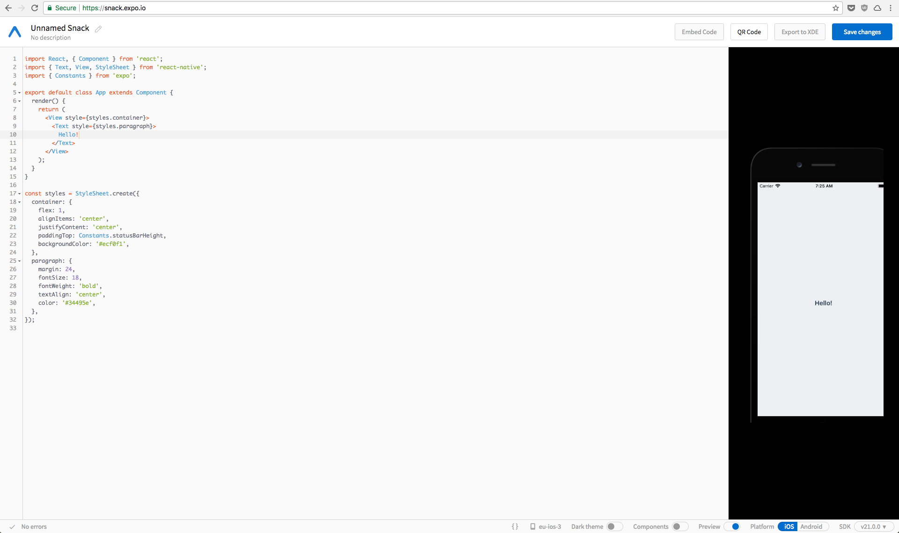

#### ReactNative


Build Mobile Apps using Javascript

---

#### What is ReactNative?
<br />

<p style="font-size:0.8em">A framework developed by Facebook that allows creating mobile apps using javascript for iOS, Android and Windows<sup>*</sup></p>

----

#### How does it work?
<br />
<p style="font-size:0.8em">ReactNative has a _hybrid_ approach using the _native capabilities_ of the operating system while the logic is executed asynchronous in Javascript.</p>

||||
|:-:|:-:|:-:|
|Native realm<p style="font-size:0.7em">(UI thread, etc)</p>|<=><p style="font-size:0.7em">(bridge)</p>|JS thread|
||||

----

#### No webviews!

```javascript
import React, { Component } from 'react';
import { Text, StyleSheet } from 'react-native';

export default class App extends Component {
  render() {
    return (
        <Text style={styles.paragraph}>
			Hello World!
        </Text>
    );
  }
}
```

----

#### Pros and Cons

----

#### Pros

* Leveraging of already known programming language (JS)
* 80% code reutilization (one code base for both platforms)
* Very good Development Experience (Hot reload)
* Using Expo.io<sup>*</sup> one can start without the need for native SDKs installed (limited features)
* Very easy to integrate native modules

----

#### Cons

* Still need to understand the platform the app is developed for
* JS is single threaded, if not treated carefully it can lead to bottlenecks
* There are times when native modules are needed
* (For now) Still at version 0.x so breaking changes are introduces with every release

----

#### Apps built with ReactNative

|||||
|:-:|:-:|:-:|:-:|
|||||
|||||
||||
https://facebook.github.io/react-native/showcase.html

---

#### Developement environment
<br />

||||
|:--|:-:|--:|
|iOS<sup>*</sup>||Xcode|
|Android||Android SDK|
|Windows 10<sup>*</sup>||Visual Studio 2017|
|All<sup>*</sup>||Expo.io|
|||node.js<sup>*</sup>|
||||

---

#### Tools

----


Expo.io - https://expo.io/

----

#### iOs and Android client



----

https://snack.expo.io/



----

#### More Tools
* Create-react-native-app - https://github.com/react-community/create-react-native-app
* React-native-debugger - https://github.com/jhen0409/react-native-debugger
* Jest (unit testing) - https://facebook.github.io/jest/
* Detox (E2E testing) - https://github.com/wix/detox
* Electrode - http://www.electrode.io/

----

#### Utilities
* CodePush - http://microsoft.github.io/code-push/
* Ignite - https://infinite.red/ignite
* Awesome ReactNative - https://github.com/jondot/awesome-react-native

---

#### Variations
* react-native-web - https://github.com/necolas/react-native-web
* ReactXP - https://microsoft.github.io/reactxp/
* react-native-macos - https://github.com/ptmt/react-native-macos

---

#### Notable contributions
* AirBnb - open source modules (maps, navigation, animation) and core contribution
* Microsoft - tools (react-native-windows, ReactXP, CodePush)
* Wix - open source modules (interactable, navigation) and tools (Detox)
* Walmart - tools (Electrode)

---

#### Questions ?

---

#### Thank you
<br />
https://github.com/rborn/react-native-introduction-webminar
<br />
<br />
@dan_tamas